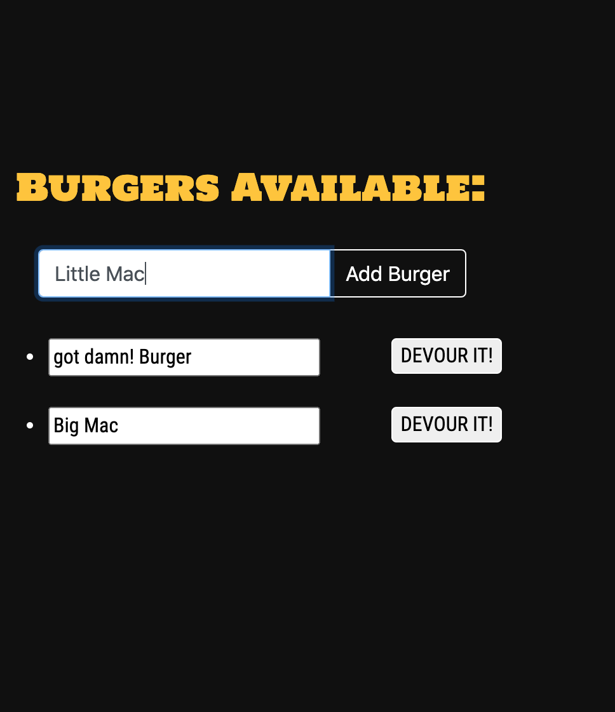
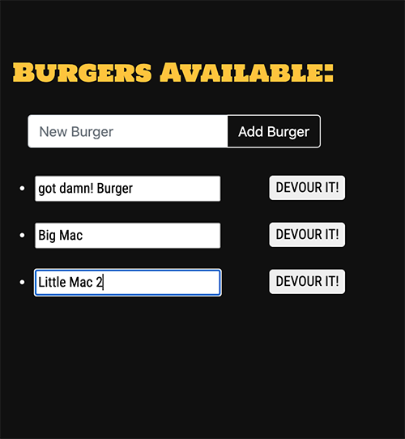
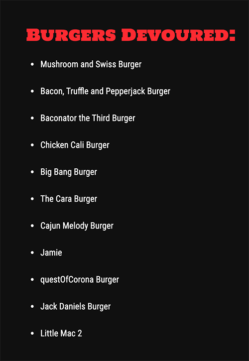

# EAT-DA-BURGER APP

### Overview

The Eat-Da-Burger app adds a new burger, updates the burger name and shows a list of devoured/not-devoured burgers.

These functionalities are created using MySQL, Node, Express, Handlebars and a homemade ORM (Object-Relational-Mapper). It follows the MVC (Model View Controller) design pattern. Express is used to create the web app. Node and MySQL is used to make queries to the burgers table. Handlebars renders the HTML pages and the ORM handles the SQL queries.

### Usage

To use the app, the user just needs to add a burger he or she wants to eat using the text input on the left of the screen. After pressing "Add Burger", a new burger entry will be added to the list below it. 

To update the burger name, type in the text box as shown below and click away. The burger name will be automatically updated and the page will refresh.

Pressing the "DEVOUR IT!" button next to it will move your burger to the "Burger Devoured" list on the right.

Go to https://enigmatic-hamlet-73997.herokuapp.com/ to try it out! All burger entries will be stored in the database.
